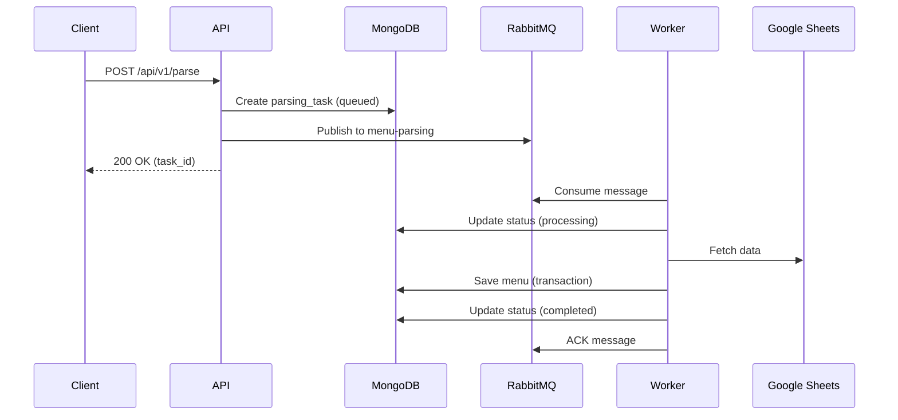
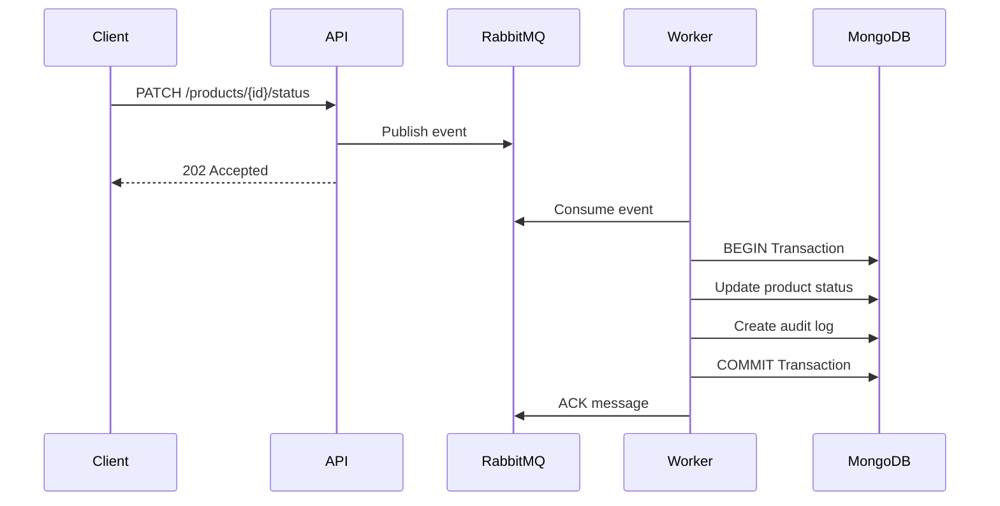

# 🍽️ Restaurant Menu Parser Microservice

[](https://go.dev/)
[](https://www.mongodb.com/)
[](https://www.rabbitmq.com/)
[](https://www.docker.com/)

Асинхронный микросервис на Go для парсинга ресторанного меню из Google Таблиц с использованием очередей сообщений для обеспечения надежности и отказоустойчивости.

---

## 🌟 Обзор

Микросервис предназначен для:

- **Асинхронного парсинга** меню из Google Sheets через API v4
- **Надежной обработки** через систему очередей RabbitMQ
- **Транзакционного обновления** статусов продуктов с аудитом
- **Масштабируемой архитектуры** с поддержкой нескольких воркеров

### Ключевые возможности

✅ Парсинг меню из Google Таблиц с группировкой атрибутов  
✅ Асинхронная обработка через RabbitMQ  
✅ MongoDB транзакции для критичных операций  
✅ Retry механизм с экспоненциальной задержкой  
✅ Dead Letter Queue для проблемных сообщений  
✅ Graceful shutdown с завершением текущих задач  
✅ Полный аудит изменений статусов продуктов  
✅ Health checks для всех сервисов  

---

## 🏗️ Архитектура

```
┌─────────────┐      ┌─────────────┐      ┌─────────────┐
│   Client    │──┬──▶│   API       │─────▶│  RabbitMQ   │
│             │  │   │  (Port 8080)│      │             │
└─────────────┘  │   └─────────────┘      └──────┬──────┘
                 │          │                     │
                 │          ▼                     ▼
                 │   ┌─────────────┐      ┌─────────────┐
                 └──▶│  MongoDB    │◀─────│   Worker    │
                     │ (Replica Set)│      │             │
                     └─────────────┘      └─────────────┘
                            │                     │
                            └─────────┬───────────┘
                                      ▼
                              ┌─────────────┐
                              │Google Sheets│
                              └─────────────┘
```

### Компоненты

- **API Server** - HTTP REST API на Gin Framework (порт 8080)
- **Worker** - Обработчик очередей для парсинга и обновления статусов
- **MongoDB** - Основное хранилище данных (Replica Set для транзакций)
- **RabbitMQ** - Брокер сообщений с Dead Letter Queue
- **Google Sheets API** - Источник данных меню

---

## 🛠️ Стек технологий

| Технология | Версия | Назначение |
|------------|--------|------------|
| **Go** | 1.21+ | Основной язык разработки |
| **MongoDB** | 6.0+ | База данных (Replica Set) |
| **RabbitMQ** | 3.x | Брокер сообщений |
| **Gin** | Latest | Web Framework |
| **Google Sheets API** | v4 | Парсинг данных |
| **Docker** | Latest | Контейнеризация |
| **Docker Compose** | v3.8+ | Оркестрация |

### Go библиотеки

- `go.mongodb.org/mongo-driver` - MongoDB драйвер
- `github.com/gin-gonic/gin` - HTTP фреймворк
- `github.com/rabbitmq/amqp091-go` - RabbitMQ клиент
- `google.golang.org/api/sheets/v4` - Google Sheets API

---

## 🚀 Быстрый старт

### Предварительные требования

- Docker & Docker Compose установлены
- Google Service Account с доступом к Google Sheets API
- Минимум 2GB свободной оперативной памяти

### 1. Клонирование репозитория

```bash
git clone https://github.com/your-repo/restaurant-menu-parser.git
cd restaurant-menu-parser
```

### 2. Настройка окружения

Создайте `.env` файл на основе примера:

```bash
cp .env.example .env
```

Заполните обязательные параметры:

```env
# Основные настройки
ENV=local
LOGGER_LEVEL=debug
HTTP_PORT=8080

# MongoDB
MONGO_USER=admin
MONGO_PASS=securepassword123
MONGO_DB_NAME=menu_parser
MONGO_PORT_HOST=27017

# RabbitMQ
RABBIT_USER=guest
RABBIT_PASS=guest
RABBIT_PORT_HOST=5672
RABBIT_MGMT_PORT_HOST=15672

# Google Sheets (Base64 encoded JSON)
GOOGLE_SERVICE_ACCOUNT_JSON=ewogICJ0eXBlIjogInNlcnZpY2VfYWNjb3VudCIsC...
```

> ⚠️ **ВАЖНО**: `GOOGLE_SERVICE_ACCOUNT_JSON` должен быть **Base64-кодированным** содержимым вашего JSON-ключа Service Account.

**Как закодировать JSON ключ:**

```bash
base64 -i service-account-key.json | tr -d '\n' > encoded.txt
```

### 3. Запуск сервисов

```bash
docker-compose up --build -d
```

### 4. Инициализация MongoDB Replica Set

После запуска контейнеров необходимо один раз инициализировать Replica Set:

```bash
# Дождитесь полного запуска MongoDB (15-20 секунд)
sleep 20

# Инициализация выполняется автоматически через mongo_init сервис
# Проверьте статус:
docker-compose logs mongo_init
```

Вы должны увидеть:
```
✅ MongoDB Setup Complete - Ready for transactions!
```

### 5. Проверка работоспособности

```bash
# Health check
curl http://localhost:8080/api/v1/health

# Должен вернуть:
# {"status":"healthy","timestamp":"2025-11-16T...","services":{"database":"ok","queue":"ok"}}
```

### Доступ к сервисам

| Сервис | URL | Credentials |
|--------|-----|-------------|
| API | http://localhost:8080 | - |
| RabbitMQ Management | http://localhost:15672 | guest/guest |
| MongoDB | mongodb://localhost:27017 | admin/securepassword123 |

---

## 📊 Структура данных

### Формат Google Таблицы

Парсер читает все листы (например: `Бургеры`, `Напитки`, `Десерты`) и ожидает следующую структуру:

| Колонка | Индекс | Поле | Описание |
|---------|--------|------|----------|
| A | 0 | `ProductID` | Внешний ID продукта |
| B | 1 | `ProductName` | Название продукта |
| C | 2 | `ProductPrice` | Базовая цена |
| D | 3 | `ProductImage` | URL изображения |
| E | 4 | `ProductDescription` | Описание |
| F | 5 | `AttributeGroupID` | ID группы атрибутов |
| G | 6 | `AttributeGroupName` | Название группы |
| H | 7 | `AttributeGroupType` | Тип группы |
| I | 8 | `AttributeID` | ID атрибута |
| J | 9 | `AttributeName` | Название атрибута |
| K | 10 | `AttributeImage` | URL изображения атрибута |
| L | 11 | `AttributeMin` | Минимальное количество |
| M | 12 | `AttributeMax` | Максимальное количество |
| N | 13 | `AttributePrice` | Цена атрибута |

### Выходной JSON формат

```json
{
  "_id": "68f5c70eeeb0a578f4d5dbd6",
  "name": "Burger King",
  "restaurant_id": "restaurant_001",
  "products": [
    {
      "ext_id": "1001001",
      "name": "Воппер",
      "price": 350.00,
      "image_url": "https://...",
      "description": "Классический бургер",
      "status": "available",
      "attribute_groups": ["attr_group_1", "attr_group_2"]
    }
  ],
  "attributes_groups": [
    {
      "ext_id": "attr_group_1",
      "name": "Добавки",
      "type": "multiple",
      "min_selection": 0,
      "max_selection": 5
    }
  ],
  "attributes": [
    {
      "ext_id": "attr_001",
      "name": "Сыр",
      "price": 50.00,
      "image_url": "https://...",
      "group_id": "attr_group_1"
    }
  ],
  "created_at": "2025-11-16T10:00:00Z",
  "updated_at": "2025-11-16T10:00:00Z"
}
```

---

## 🔌 API Endpoints

### Base URL
```
http://localhost:8080/api/v1
```

### 1. Health Check

Проверяет доступность MongoDB и RabbitMQ.

```http
GET /api/v1/health
```

**Response 200 OK:**
```json
{
  "status": "healthy",
  "timestamp": "2025-11-16T10:00:00Z",
  "services": {
    "database": "ok",
    "queue": "ok"
  }
}
```

---

### 2. Запуск парсинга (Асинхронно)

Создает задачу парсинга и ставит ее в очередь `menu-parsing`.

```http
POST /api/v1/parse
Content-Type: application/json

{
  "spreadsheet_id": "1ABC...xyz",
  "restaurant_name": "Burger King"
}
```

**Response 200 OK:**
```json
{
  "task_id": "550e8400-e29b-41d4-a716-446655440000",
  "status": "queued"
}
```

**Коды ответов:**
- `200` - Задача успешно поставлена в очередь
- `400` - Невалидные данные запроса
- `500` - Внутренняя ошибка сервера

---

### 3. Проверка статуса задачи

Получает текущий статус задачи парсинга.

```http
GET /api/v1/parse/{task_id}
```

**Response 200 OK:**
```json
{
  "task_id": "550e8400-e29b-41d4-a716-446655440000",
  "status": "completed",
  "menu_id": "68f5c70eeeb0a578f4d5dbd6",
  "created_at": "2025-11-16T10:00:00Z",
  "updated_at": "2025-11-16T10:05:00Z"
}
```

**Возможные статусы:**
- `queued` - Задача в очереди
- `processing` - Выполняется парсинг
- `completed` - Парсинг завершен успешно
- `failed` - Произошла ошибка

**Response 200 OK (Failed):**
```json
{
  "task_id": "550e8400-e29b-41d4-a716-446655440000",
  "status": "failed",
  "error": "Failed to fetch spreadsheet: permission denied",
  "retry_count": 3,
  "created_at": "2025-11-16T10:00:00Z",
  "updated_at": "2025-11-16T10:03:00Z"
}
```

---

### 4. Получение меню

Возвращает полное спарсенное меню.

```http
GET /api/v1/menu/{menu_id}
```

**Response 200 OK:**
```json
{
  "_id": "68f5c70eeeb0a578f4d5dbd6",
  "name": "Burger King",
  "restaurant_id": "restaurant_001",
  "products": [...],
  "attributes_groups": [...],
  "attributes": [...],
  "created_at": "2025-11-16T10:00:00Z",
  "updated_at": "2025-11-16T10:05:00Z"
}
```

**Коды ответов:**
- `200` - Меню найдено
- `404` - Меню не существует
- `500` - Ошибка базы данных

---

### 5. Обновление статуса продукта (Асинхронно)

Ставит задачу изменения статуса продукта в очередь `product-status`.

```http
PATCH /api/v1/products/{product_id}/status
Content-Type: application/json

{
  "status": "not_available",
  "reason": "out_of_stock",
  "user_id": "admin_123"
}
```

**Допустимые статусы:**
- `available` - Продукт доступен
- `not_available` - Продукт недоступен
- `deleted` - Продукт удален

**Response 202 Accepted:**
```json
{
  "success": true,
  "message": "Status update queued"
}
```

**Коды ответов:**
- `202` - Событие успешно поставлено в очередь
- `400` - Невалидный статус
- `500` - Ошибка публикации в очередь

---

## 📨 Работа с очередями

Система использует две очереди RabbitMQ:

### 1. `menu-parsing` - Парсинг меню

**Процесс обработки:**



**Формат сообщения:**
```json
{
  "task_id": "550e8400-e29b-41d4-a716-446655440000",
  "spreadsheet_id": "1ABC...xyz",
  "restaurant_name": "Burger King",
  "timestamp": "2025-11-16T10:00:00Z"
}
```

---

### 2. `product-status` - Изменение статусов

**Процесс обработки:**



**Типы событий:**

| Event Type | Описание |
|------------|----------|
| `product.created` | Создание продукта |
| `product.updated` | Обновление продукта |
| `product.status_changed` | Изменение статуса |
| `product.deleted` | Удаление продукта |

**Формат события:**
```json
{
  "event_type": "product.status_changed",
  "product_id": "1001002",
  "old_status": "available",
  "new_status": "not_available",
  "reason": "out_of_stock",
  "user_id": "admin_123",
  "timestamp": "2025-11-16T10:00:00Z"
}
```

---

### Механизмы надежности

#### 1. Retry механизм

- **3 попытки** с экспоненциальной задержкой
- Задержка: 1s → 2s → 4s

```go
delays := []time.Duration{
    1 * time.Second,
    2 * time.Second,
    4 * time.Second,
}
```

#### 2. Dead Letter Queue (DLQ)

Сообщения попадают в DLQ после:
- Исчерпания всех retry попыток
- Ошибок десериализации
- Критических ошибок обработки

#### 3. Graceful Shutdown

Worker корректно завершает текущие задачи при получении SIGTERM/SIGINT:

1. Перестает принимать новые сообщения
2. Завершает текущие задачи (timeout: 30s)
3. Закрывает соединения с MongoDB и RabbitMQ
4. Выходит с кодом 0

---

## 🗄️ База данных

MongoDB запущена в режиме **Replica Set** для поддержки транзакций.

### Коллекции

#### 1. `menus`

Хранит спарсенные меню ресторанов.

```javascript
{
  _id: ObjectId("68f5c70eeeb0a578f4d5dbd6"),
  name: "Burger King",
  restaurant_id: "restaurant_001",
  products: Array,
  attributes_groups: Array,
  attributes: Array,
  created_at: ISODate("2025-11-16T10:00:00Z"),
  updated_at: ISODate("2025-11-16T10:05:00Z")
}
```

**Индексы:**
```javascript
db.menus.createIndex({ "restaurant_id": 1 })
db.menus.createIndex({ "products.ext_id": 1 })
db.menus.createIndex({ "created_at": -1 })
```

---

#### 2. `parsing_tasks`

Отслеживает статус задач парсинга.

```javascript
{
  _id: "550e8400-e29b-41d4-a716-446655440000", // UUID
  status: "completed", // queued | processing | completed | failed
  spreadsheet_id: "1ABC...xyz",
  restaurant_name: "Burger King",
  menu_id: ObjectId("68f5c70eeeb0a578f4d5dbd6"),
  error_message: null,
  retry_count: 0,
  created_at: ISODate("2025-11-16T10:00:00Z"),
  updated_at: ISODate("2025-11-16T10:05:00Z")
}
```

**Индексы:**
```javascript
db.parsing_tasks.createIndex({ "_id": 1 })
db.parsing_tasks.createIndex({ "status": 1 })
db.parsing_tasks.createIndex({ "created_at": -1 })
```

---

#### 3. `product_status_audit`

Аудит всех изменений статусов продуктов.

```javascript
{
  _id: ObjectId("..."),
  product_id: "1001002",
  event_type: "product.status_changed",
  old_status: "available",
  new_status: "not_available",
  reason: "out_of_stock",
  user_id: "admin_123",
  timestamp: ISODate("2025-11-16T10:00:00Z")
}
```

**Индексы:**
```javascript
db.product_status_audit.createIndex({ "product_id": 1, "timestamp": -1 })
db.product_status_audit.createIndex({ "timestamp": -1 })
db.product_status_audit.createIndex({ "event_type": 1 })
```

---

### Connection Pool

```go
clientOptions := options.Client().
    ApplyURI(mongoURI).
    SetMaxPoolSize(100).
    SetMinPoolSize(10).
    SetMaxConnIdleTime(30 * time.Second).
    SetConnectTimeout(10 * time.Second).
    SetServerSelectionTimeout(5 * time.Second)
```

---

## ⚙️ Конфигурация

### Переменные окружения

#### Приложение
```env
ENV=local              # local | dev | prod
LOGGER_LEVEL=debug     # debug | info | warn | error
HTTP_PORT=8080         # Порт API сервера
```

#### MongoDB
```env
MONGO_USER=admin
MONGO_PASS=securepassword123
MONGO_DB_NAME=menu_parser
MONGO_PORT_HOST=27017
```

#### RabbitMQ
```env
RABBIT_USER=guest
RABBIT_PASS=guest
RABBIT_PORT_HOST=5672
RABBIT_MGMT_PORT_HOST=15672
```

#### Google Sheets
```env
# Base64 закодированный JSON ключ Service Account
GOOGLE_SERVICE_ACCOUNT_JSON=ewogICJ0eXBlIjog...
```

---

### Docker Compose структура

```yaml
services:
  api:          # HTTP API (порт 8080)
  worker:       # Worker для очередей
  mongodb:      # База данных (Replica Set)
  rabbitmq:     # Брокер сообщений
  mongo_init:   # Инициализация Replica Set
```

**Сеть:** `menu-parser-network` (bridge)

**Volumes:**
- `mongodb_data` - Персистентные данные MongoDB

---

## 📊 Мониторинг

### Health Checks

Все сервисы имеют health checks:

```yaml
# API
healthcheck:
  test: ["CMD", "wget", "--quiet", "-O", "/dev/null", "http://localhost:8080/api/v1/health"]
  interval: 10s
  timeout: 5s
  retries: 5

# MongoDB
healthcheck:
  test: ["CMD", "mongosh", "--eval", "db.adminCommand('ping')"]
  interval: 10s
  
# RabbitMQ
healthcheck:
  test: ["CMD", "rabbitmq-diagnostics", "check_port_connectivity"]
  interval: 10s
```

---

### Логирование

Структурированное логирование через `log/slog`:

```go
log.Info("Task queued", 
    "task_id", taskID,
    "spreadsheet_id", req.SpreadsheetID)

log.Error("Failed to parse menu",
    "task_id", taskID,
    "error", err)
```

**Уровни логирования:**
- `DEBUG` - Детальная отладочная информация
- `INFO` - Основные события системы
- `WARN` - Предупреждения
- `ERROR` - Ошибки

---

### RabbitMQ Management UI

Доступ к веб-интерфейсу RabbitMQ:

```
URL: http://localhost:15672
Login: guest
Password: guest
```

**Мониторинг:**
- Количество сообщений в очередях
- Rate of message publishing/consuming
- Connection и Channel статус
- Dead Letter Queue

---

## 🛑 Остановка и очистка

### Остановка сервисов

```bash
docker-compose down
```

### Полная очистка (включая volumes)

```bash
docker-compose down -v
```

⚠️ **Внимание:** Эта команда удалит все данные MongoDB!

---

## 🔧 Разработка

### Локальный запуск (без Docker)

```bash
# Установка зависимостей
go mod download

# Запуск API
go run cmd/api/main.go

# Запуск Worker
go run cmd/worker/main.go
```

### Линтинг

```bash
golangci-lint run
```

---

## 📝 Примеры использования

### 1. Запуск полного цикла парсинга

```bash
# 1. Запустить парсинг
TASK_ID=$(curl -s -X POST http://localhost:8080/api/v1/parse \
  -H "Content-Type: application/json" \
  -d '{
    "spreadsheet_id": "1ABC...xyz",
    "restaurant_name": "Burger King"
  }' | jq -r '.task_id')

echo "Task ID: $TASK_ID"

# 2. Проверить статус (подождать 10 секунд)
sleep 10
curl http://localhost:8080/api/v1/parse/$TASK_ID | jq

# 3. Получить меню
MENU_ID=$(curl -s http://localhost:8080/api/v1/parse/$TASK_ID | jq -r '.menu_id')
curl http://localhost:8080/api/v1/menu/$MENU_ID | jq
```

### 2. Изменение статуса продукта

```bash
# Сделать продукт недоступным
curl -X PATCH http://localhost:8080/api/v1/products/1001002/status \
  -H "Content-Type: application/json" \
  -d '{
    "status": "not_available",
    "reason": "out_of_stock",
    "user_id": "admin_123"
  }'
```

### 3. Просмотр аудита изменений

```bash
# Подключение к MongoDB
docker exec -it menu_parser_db mongosh \
  -u admin -p securepassword123 --authenticationDatabase admin

# Просмотр аудита для продукта
use menu_parser
db.product_status_audit.find(
  { "product_id": "1001002" }
).sort({ "timestamp": -1 })
```

---

## 🐛 Troubleshooting

### MongoDB не запускается

**Проблема:** `security.keyFile is required when authorization is enabled`

**Решение:** Убедитесь, что `mongo_init` сервис успешно завершился:
```bash
docker-compose logs mongo_init
```

---

### Worker не обрабатывает сообщения

**Проблема:** Сообщения остаются в очереди

**Решение:**
1. Проверьте логи worker: `docker-compose logs worker`
2. Проверьте RabbitMQ: http://localhost:15672
3. Убедитесь, что MongoDB доступна

---

### Ошибка Google Sheets API

**Проблема:** `permission denied` при парсинге

**Решение:**
1. Убедитесь, что Google Sheets расшарена на email Service Account
2. Проверьте, что `GOOGLE_SERVICE_ACCOUNT_JSON` корректно закодирован в Base64
3. Включите Google Sheets API в Google Cloud Console

---

## 📄 Лицензия

MIT License

---

## 👥 Контакты

Для вопросов и предложений:
- GitHub Issues: https://github.com/ItsXomyak/restaurant-menu-parser/issues

---

**Made with ❤️ using Go**